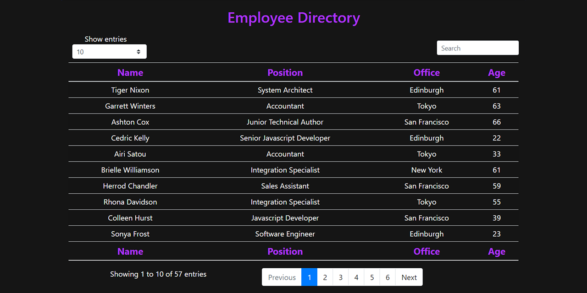

# Employee Directory

---

### Table of Contents

- [Description](#description)
- [How to Use](#how-to-use)
- [Installation](#installation)
- [Technologies](#technologies)
- [License](#license)
- [Contributors](#contributors)

---

### Description

Employee Directory is a React web application for searching & filtering a large database of employees.

---

### How to Use

Simply open the application in your browser to start using the filterable employee database.

---

### Installation

Employee Directory is live [here](https://shiftymitch-employee-directory.herokuapp.com/)

---

### Technologies

[React](https://reactjs.org/)\
[Bootstrap](https://getbootstrap.com/)\
[MDBootstrap](https://mdbootstrap.com/docs/react/tables/sort/#introduction)

---

### License

MIT © [shiftymitch](https://github.com/shiftymitch)

---

### Contributors

| Developer | GitHub |
| ------ | ------ |
| Mitch Henderson | [shiftymitch](https://github.com/shiftymitch) |

[Back to the Top](#project-name)
